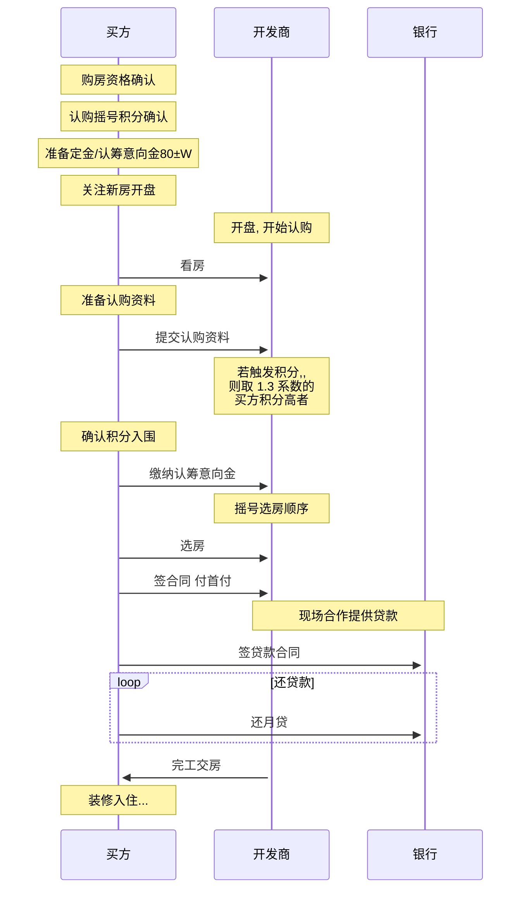

---
Title | 购房流程 一手房
-- | --
Created @ | `2022-12-18T15:29:43Z`
Updated @| `2023-03-05T16:04:33Z`
Labels | `enhancement`
Edit @| [here](https://github.com/junxnone/F/issues/44)

---
## 新房购买流程

```mermaid
sequenceDiagram
    participant 买方 
    participant 开发商
    participant 银行
    Note over 买方: 购房资格确认
    Note over 买方: 认购摇号积分确认
    Note over 买方: 准备定金/认筹意向金80±W
    Note over 买方: 关注新房开盘
    Note over 开发商: 开盘, 开始认购
    买方->>+开发商: 看房
    Note over 买方: 准备认购资料
    买方->>+开发商: 提交认购资料
    Note over 开发商: 若触发积分,,<br>则取 1.3 系数的<br>买方积分高者
    Note over 买方: 确认积分入围
    买方->>+开发商: 缴纳认筹意向金
    Note over 开发商: 摇号选房顺序
    买方->>+开发商: 选房
    买方->>+开发商: 签合同 付首付
    Note over 银行,开发商: 现场合作提供贷款
    买方->>+银行: 签贷款合同
    loop 还贷款
    买方->>+银行: 还月贷
    end 
    开发商->>+买方: 完工交房
    Note over 买方: 装修入住...

```
