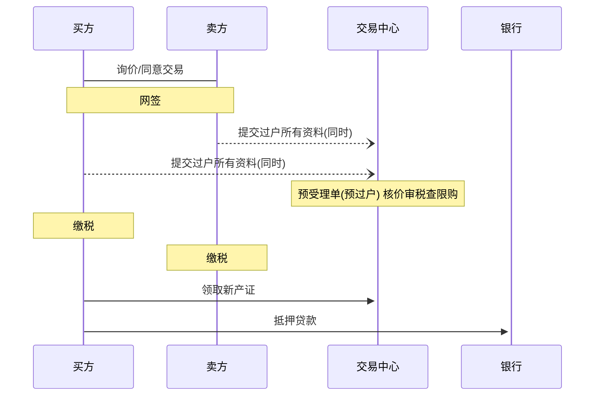

---
Title | 购房流程 二手房
-- | --
Created @ | `2022-12-18T15:29:54Z`
Updated @| `2023-03-05T16:05:04Z`
Labels | `enhancement`
Edit @| [here](https://github.com/junxnone/F/issues/45)

---
## 二手房购买流程

```mermaid
sequenceDiagram
    买方->卖方: 询价/同意交易
    Note over 买方,卖方: 网签
    卖方--)+交易中心: 提交过户所有资料(同时)
    买方--)+交易中心: 提交过户所有资料(同时)
    Note over 交易中心: 预受理单(预过户) 核价审税查限购
    Note over 买方: 缴税
    Note over 卖方: 缴税
    买方->>+交易中心:  领取新产证
    买方->>+银行: 抵押贷款


```
