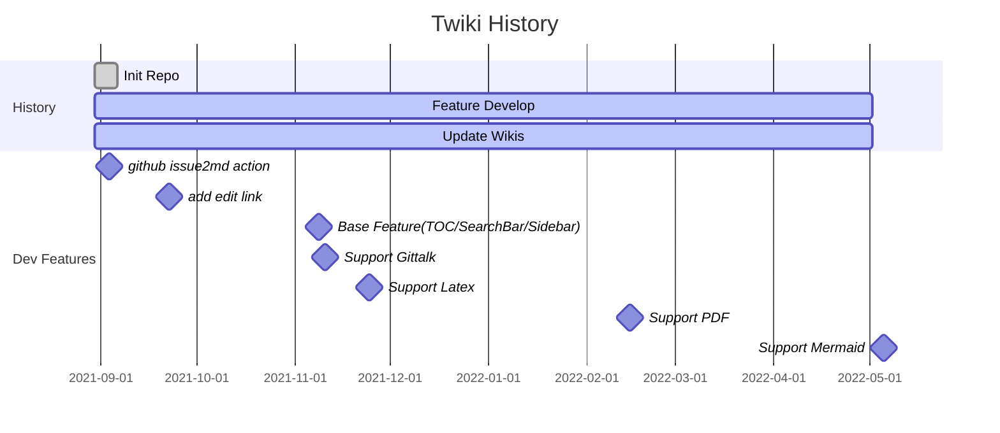

---
Title | Mermaid Support
-- | --
Create Date | `2022-05-02T12:51:31Z`
Update Date | `2022-05-02T12:57:30Z`
Edit link | [here](https://github.com/junxnone/twiki/issues/20)

---
- [mermaid-docsify](https://github.com/Leward/mermaid-docsify)
- [Mermaid js](https://mermaid-js.github.io/mermaid/#/)
- [mermaid-live-editor](https://mermaid-js.github.io/mermaid-live-editor)

---

```
gantt
    title Twiki History
    dateFormat  YYYY-MM-DD
    section History
    Init Repo           :done, 2021-08-30, 1w
    Feature Develop     :active, 2021-08-30, 2022-05-02
    Update Wikis        :active, 2021-08-30, 2022-05-02
    section Dev Features
    github issue2md action :milestone, 2021-08-31, 1w
    add edit link       :milestone, 2021-09-19, 1w
    Base Feature(TOC/SearchBar/Sidebar) :milestone, 2021-11-05, 1w
    Support Gittalk     :milestone, 2021-11-07, 1w
    Support Latex       :milestone, 2021-11-21, 1w
    Support PDF         :milestone, 2022-02-11, 1w
    Support Mermaid     :milestone, 2022-05-02, 1w
```


