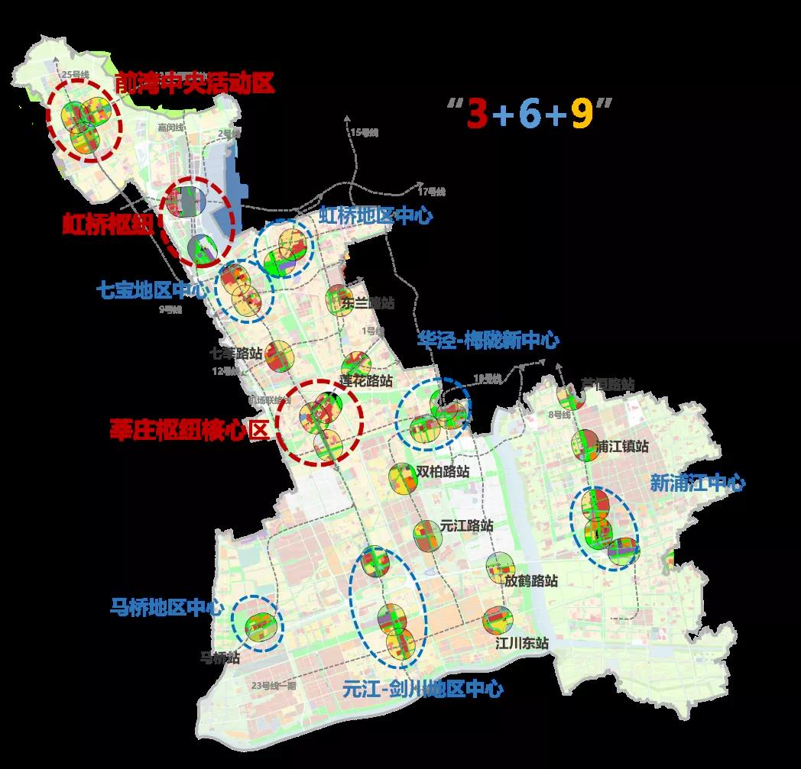
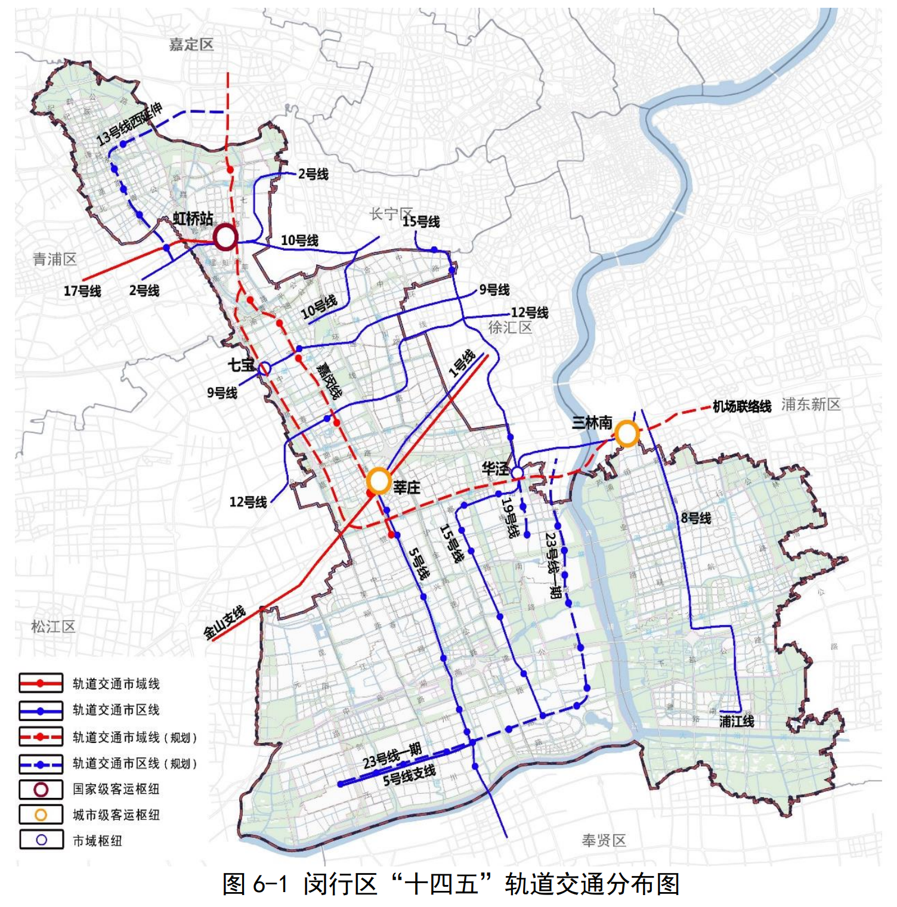
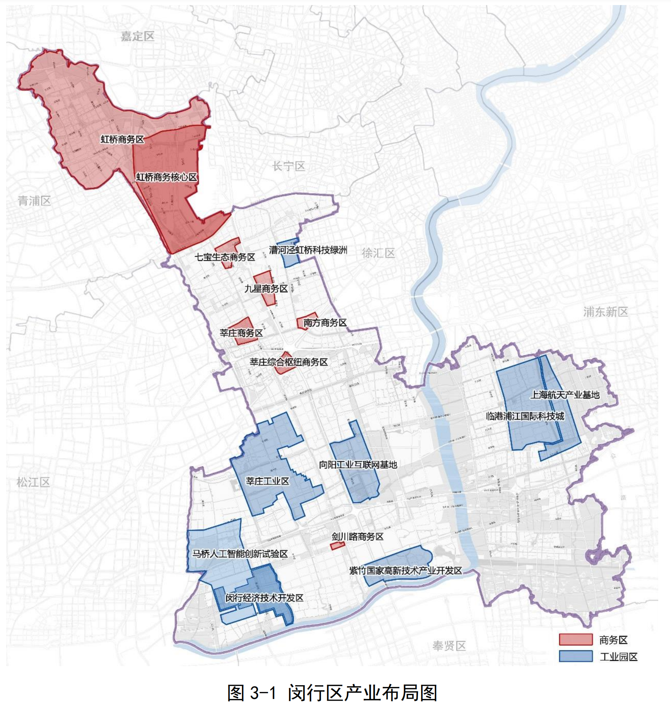
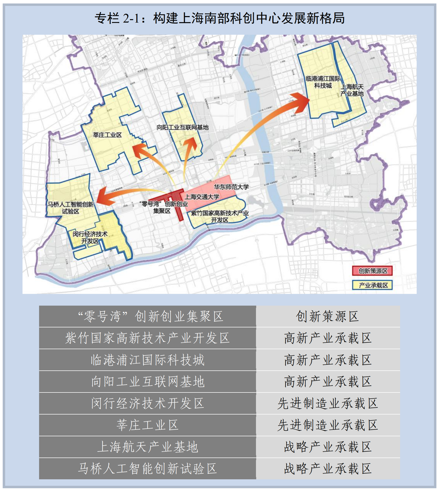
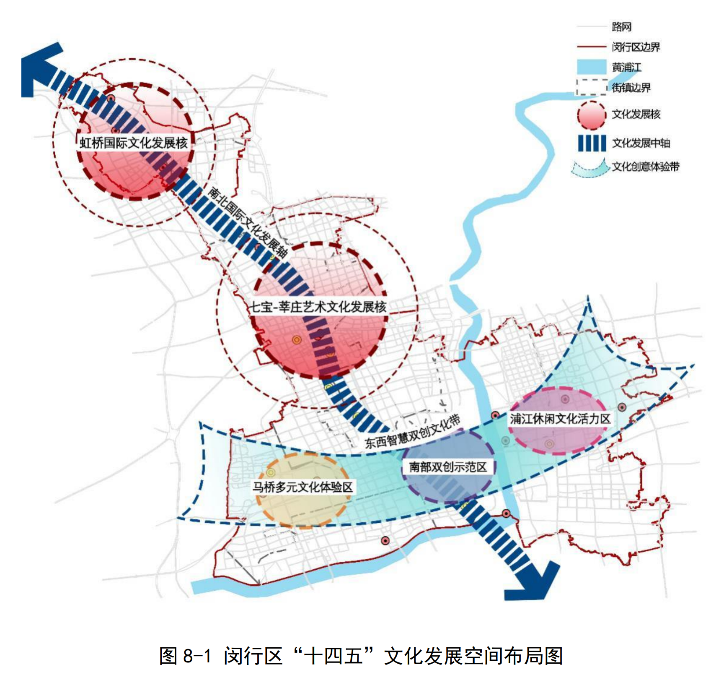
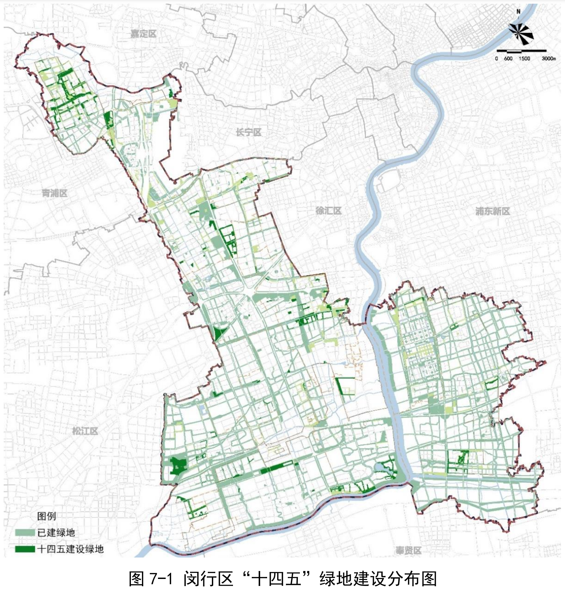

-----

| Title     | 规划 闵行                                           |
| --------- | ----------------------------------------------- |
| Created @ | `2022-10-16T03:44:34Z`                          |
| Updated @ | `2023-03-12T17:32:36Z`                          |
| Labels    | `enhancement`                                   |
| Edit @    | [here](https://github.com/junxnone/F/issues/12) |

-----

## 3+6+9



## 轨道交通



## 产业园规划





## 文化规划



## 绿地规划



## 闵行规划文件

  - 闵行 2035 规划

<!-- end list -->

``` pdf
files/上海市闵行区国民经济和社会发展第十四个五年规划和二〇三五年远景目标纲要.pdf
```

## Reference

  - [闵行规划文件](https://ghzyj.sh.gov.cn/ghjh/20230309/1818a2b721e342bfbe5837b3fc274b34.html)
