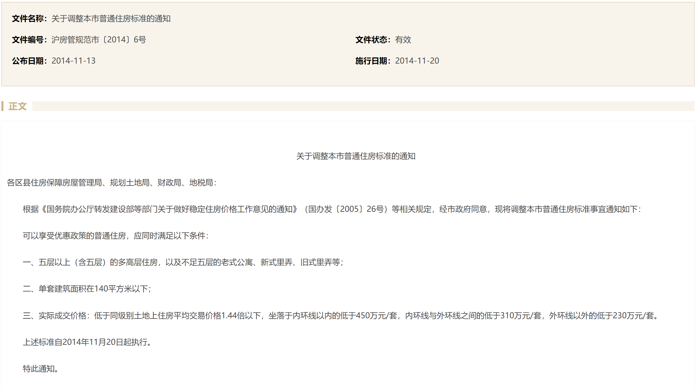
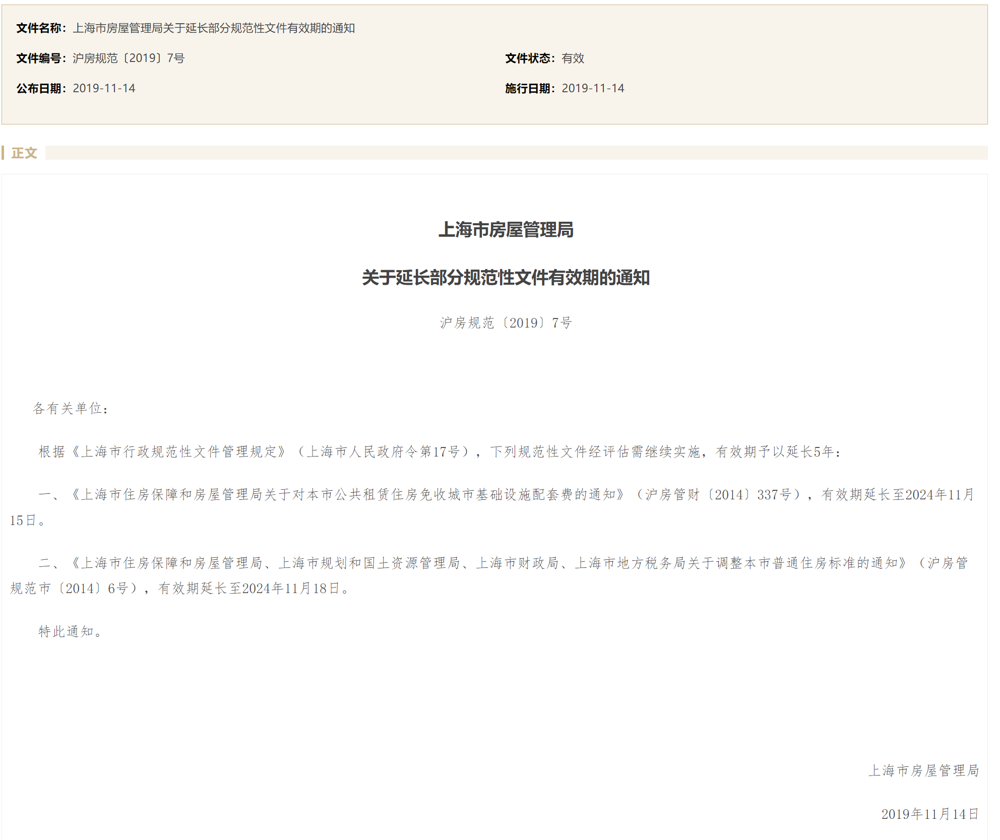

-----

| Title     | 概念 普通住房与非普通住房                                   |
| --------- | ----------------------------------------------- |
| Created @ | `2022-10-16T06:28:03Z`                          |
| Updated @ | `2023-02-24T14:02:40Z`                          |
| Labels    | `enhancement`                                   |
| Edit @    | [here](https://github.com/junxnone/F/issues/14) |

-----

## 普通住房定义条件

  - 1 五层以上（含五层）的多高层住房，以及不足五层的老式公寓、新式里弄、旧式里弄等
  - 2 单套建筑面积在140平方米以下
  - 3 实际成交价格：
      - 低于同级别土地上住房平均交易价格1.44倍以下
      - 坐落于内环线以内的低于450万元/套
      - 内环线与外环线之间的低于310万元/套
      - 外环线以外的低于230万元/套
  - **同时满足上述三个条件**

> 普通住房的条件太苛刻了吧？？？大部分交易都应该按非普通住房交易吧

## 普通住房与非普通住房税费区别

  - 个人所得税
      - 普通住房: 选全额缴纳时税点为 $\\large 1%$
      - 非普通住房: 选全额缴纳时税点为 $\\large 2%$
  - 增值税及附加税
      - 普通住房: 满两年可以 **免征**
      - 非普通住房: 无论是否满两年都同普通住房不满两年计算: $\\large 全额/1.05\*(5%+0.3%)$

## 相关文件

> 2005 年制定2008/2012/2014年调整, 2019年延续到2024年

### 沪房管规范市 \[2014\] 6 号

### 沪房规范 \[2019\] 7 号

