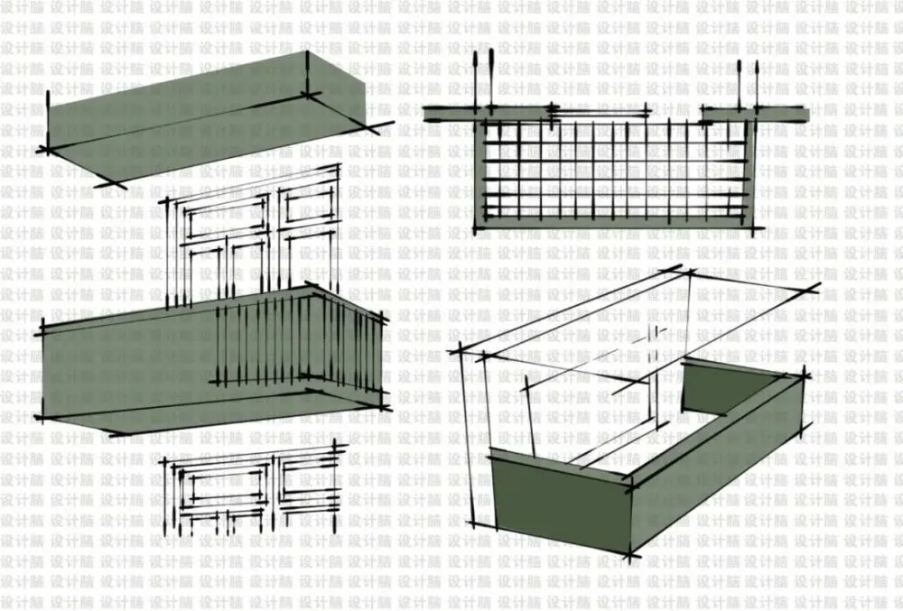
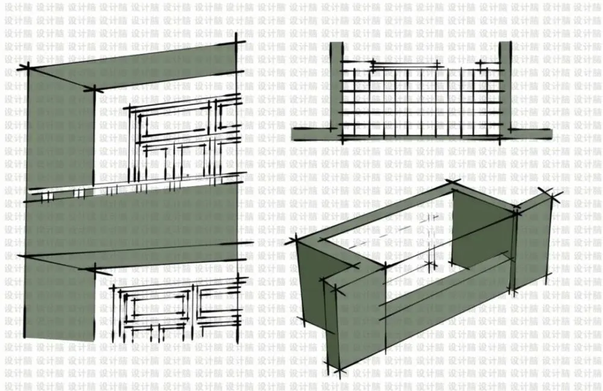
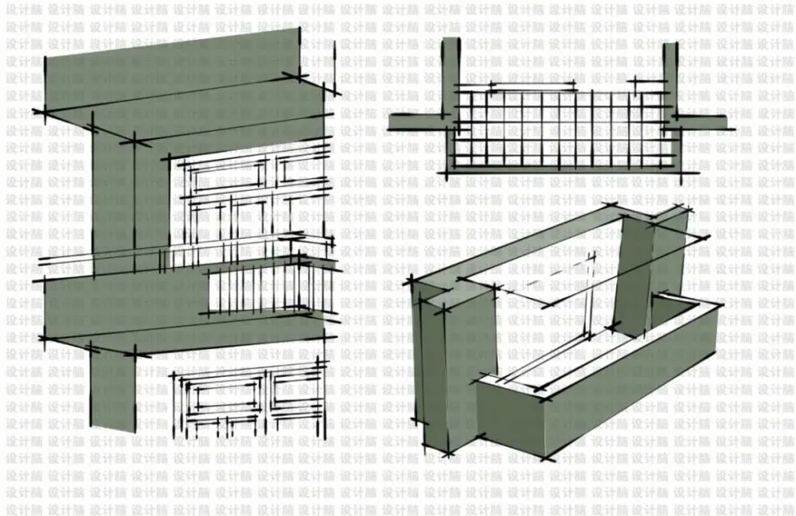

-----

| Title         | 概念 阳台                                           |
| ------------- | ----------------------------------------------- |
| Created @     | `2022-10-22T10:46:57Z`                          |
| Last Modify @ | `2022-12-24T13:47:24Z`                          |
| Labels        | `enhancement`                                   |
| Edit @        | [here](https://github.com/junxnone/F/issues/18) |

-----

  - 封闭阳台整个算入建筑面积
  - 未封闭阳台的 1/2 算入建筑面积
  - 高层一般阳台是封闭的
  - 护栏/半墙拆除做落地窗需物业许可

## 是否计入面积&计入多少

> 根据[上海市建筑面积计算规划管理规定-2021-10.pdf](https://github.com/junxnone/F/files/9996482/-2021-10.pdf)

  - 阳台符合以下条件的，阳台面积按其水平投影面积的1/2计入容积率；
  - 否则，应按其水平投影面积的全面积计入容积率：
  - `阳台的设计进深（取阳台围护结构外围至外墙面的最大垂直距离）不超过1.8米（含1.8米），且其水平投影面积小于或者等于8平方米的。`

### 阳台种类

#### 凸阳台

  - 比较常见，凸出楼梯一部分形成的阳台
  - 承重能力较弱

#### 凹阳台

  - 阳台收进楼体
  - 承重能力最强

#### 复合阳台

  - 半凸半凹
  - 承重能力居中

