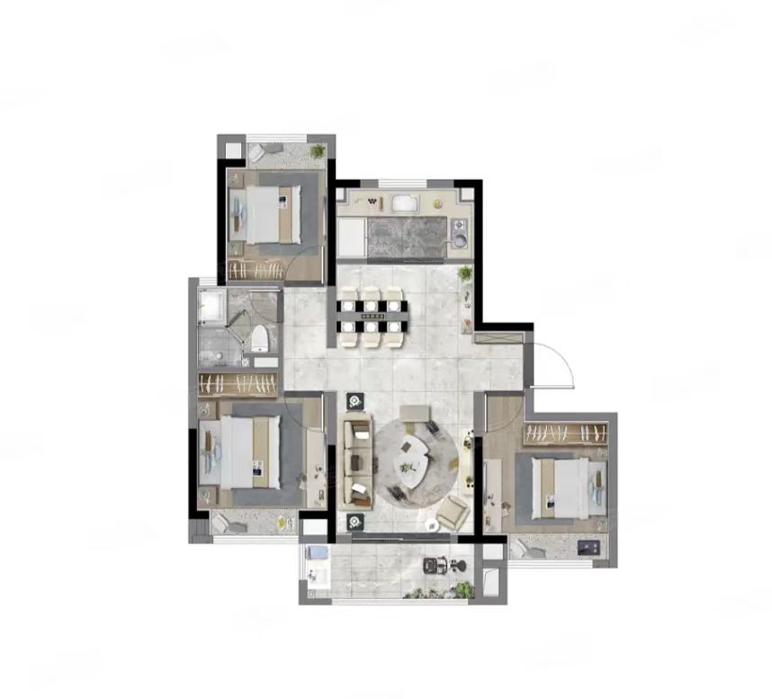
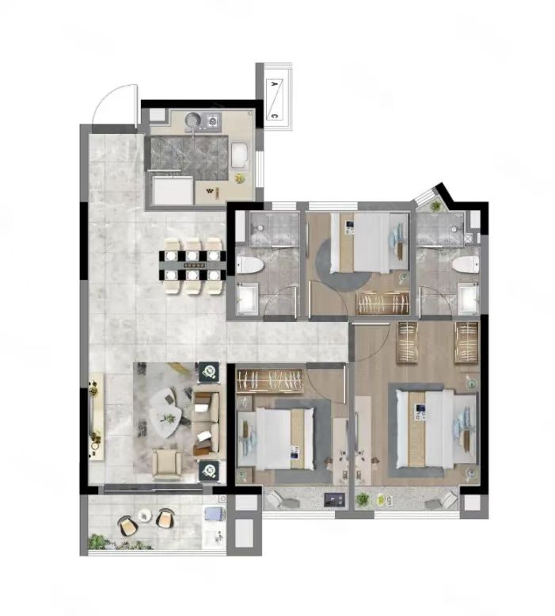
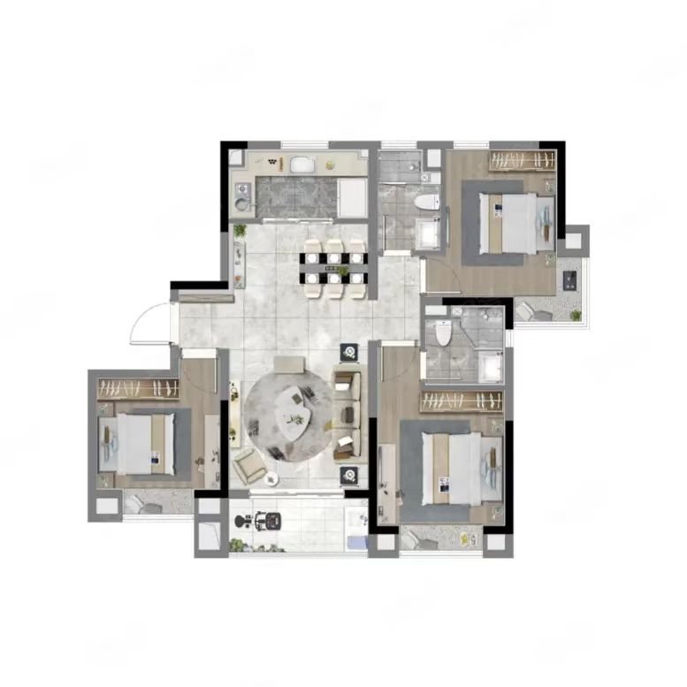

-----

| Title     | 一手房 奉贤庄行 大名城映雨江南                                |
| --------- | ----------------------------------------------- |
| Created @ | `2022-10-23T13:02:50Z`                          |
| Updated @ | `2023-02-23T18:29:16Z`                          |
| Labels    | `enhancement`                                   |
| Edit @    | [here](https://github.com/junxnone/F/issues/22) |

-----

## 基础信息

  - **位置**: 奉贤庄行庄良路60弄
  - **均价**: 3W+
  - **开发商**: 名城控股
  - **公摊/得房率**: 20%/80%
  - **楼间距**: 30m+
  - **交通**:
      - **规划中**: 嘉闵线延伸线/南枫线
  - **物业费**: 3.8 ¥/m2/月
  - **容积率**: 1.8
  - **绿化率**: 35%

## 户型

| 户型一 94 m2                                                    | 户型二 99 m2                                                    | 户型三 108 m2                                                   |
| ------------------------------------------------------------ | ------------------------------------------------------------ | ------------------------------------------------------------ |
|  |  |  |

### 贷款计算

| x  | 户型一 94 m2 | 户型二 99 m2 | 户型三 108 m2 |
| -- | --------- | --------- | ---------- |
| 总价 | 2740000   | 3061000   | 3351000    |
| 单价 | 28643     | 30668     | 30585      |
| 首付 | 95w       | 107w      | 117w       |
| 贷款 | 178w      | 198w      | 217w       |
| 月供 | 8400      | 9500      | 10100      |

> 销售说有 99 折

## 位置

\[[新页面查看地图](https://junxnone.github.io/fmap/at/yyjn)\]

[映雨江南
map](https://junxnone.github.io/fmap/at/yyjn ":include :type=iframe width=100% height=600px")
