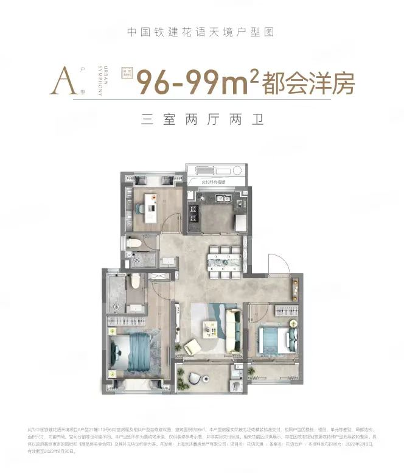

-----

| Title     | 一手房 松江泗泾 花语天镜                                   |
| --------- | ----------------------------------------------- |
| Created @ | `2022-11-13T03:56:33Z`                          |
| Updated @ | `2023-02-23T18:28:59Z`                          |
| Labels    | `enhancement`                                   |
| Edit @    | [here](https://github.com/junxnone/F/issues/25) |

-----

## 基础信息

  - **位置**: 松江泗泾
  - **均价**: 4.8W
  - **开发商**: 中国铁建
  - **物业费**: 4.5 ¥/m2/月
  - **容积率**: 1.2
  - **绿化率**: 35%
  - **得房率**: 78-80%
  - **阳台**: 凹阳台 (全部计入面积)
  - **车位**: 1160
  - **规划户数**: 931
  - **交通**: 9号线 泗泾站(2km)
  - **楼间距**: ?

## 户型

  - 飞机户型

| 户型  | 99m2                                                         |
| --- | ------------------------------------------------------------ |
| 户型图 |  |

### 贷款计算

| 总价 | 461.3 W |
| -- | ------- |
| 首付 | 161.3 W |
| 贷款 | 300 W   |
| 月供 | 1.47 W  |

## 位置

\[[新页面查看地图](https://junxnone.github.io/fmap/at/hytj)\]

[花语天镜
map](https://junxnone.github.io/fmap/at/hytj ":include :type=iframe width=100% height=600px")
