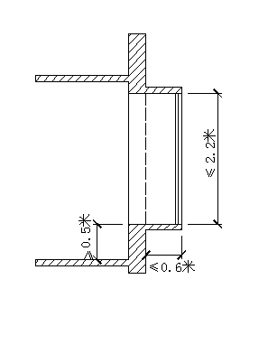

-----

| Title         | 概念 飘窗                                           |
| ------------- | ----------------------------------------------- |
| Created @     | `2022-11-13T04:03:27Z`                          |
| Last Modify @ | `2022-12-24T13:46:18Z`                          |
| Labels        | `enhancement`                                   |
| Edit @        | [here](https://github.com/junxnone/F/issues/26) |

-----

## Reference

  - [关于印发《上海市建筑面积计算规划管理规定》的通知](https://hd.ghzyj.sh.gov.cn/zcfg/ghss/202110/t20211011_1032711.html)

## 上海市建筑面积计算规划管理规定

  - 飘窗符合以下条件的，不计算建筑面积；
  - 否则，应按挑出外墙部分的投影面积计算建筑面积并计入容积率：
  - `飘窗台面与室内地面的高差应不小于0.5米，飘窗高度应不超过2.2米，且自外墙墙体结构外边线至飘窗外边线距离不超过0.6米。`

