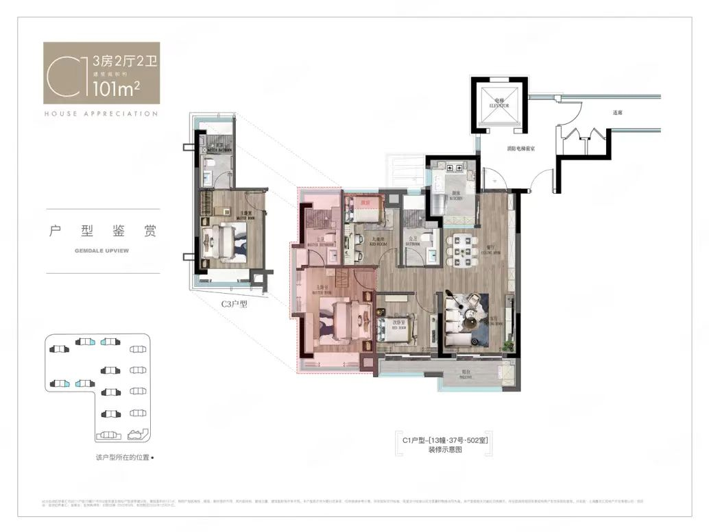
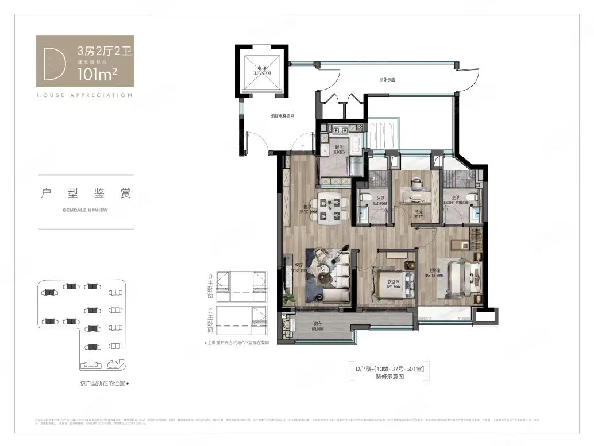
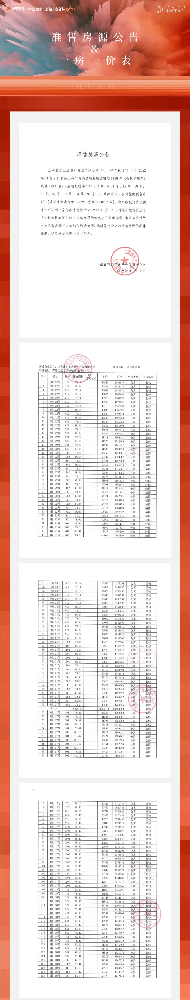
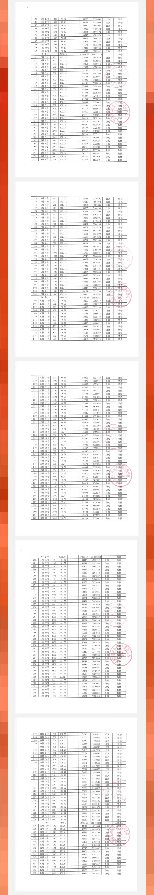
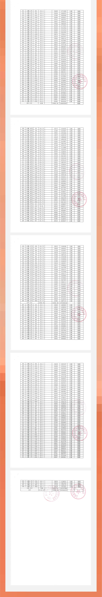

-----

| Title     | 一手房 青浦赵巷 金地虹桥峯汇                                 |
| --------- | ----------------------------------------------- |
| Created @ | `2022-11-14T12:07:42Z`                          |
| Updated @ | `2023-02-23T18:29:07Z`                          |
| Labels    | `enhancement`                                   |
| Edit @    | [here](https://github.com/junxnone/F/issues/30) |

-----

## 基本信息

  - **开发商**: 金地
  - **位置**: 青浦赵巷
  - **均价**: 5.2 W
  - **容积率**: 2.2
  - **绿化率**: 35%
  - **得房率**: 74% \~77%
  - **物业费**: 3.5 ¥/m2/月
  - **车位比**: 960
  - **规划户数**: 886
  - **交通**: 17 号线 嘉松中路 450 m
  - **楼间距**:
  - **总楼层**: 15 \~18
  - **层高**: 2.95 m
  - **梯户**: 2 梯 4 户

### 一批次

  - **认购时间**: 2022.11.11 \~ 11.15
  - **开盘时间**: 2022.11.27
  - **房源数**: 538
  - **一房一价表**: [一批次一房一价表](#一批次一房一价表)
  - **户型数量**: `78 m2 * 99` / `88 m2 * 99` / `101 m2 * 340`

## 户型

  - [x] 动静分离户型
  - [ ] 飞机户型

| 户型  | C1 101m2                                                     | D 101 m2                                                     |
| --- | ------------------------------------------------------------ | ------------------------------------------------------------ |
| 户型图 |  |  |

### 贷款

| 总价 | W |
| -- | - |
| 首付 | W |
| 月供 | W |

## 位置

\[[新页面查看地图](https://junxnone.github.io/fmap/at/jdfh)\]

[金地虹桥峯汇
map](https://junxnone.github.io/fmap/at/jdfh ":include :type=iframe width=100% height=600px")

## 一房一价表

### 一批次一房一价表

