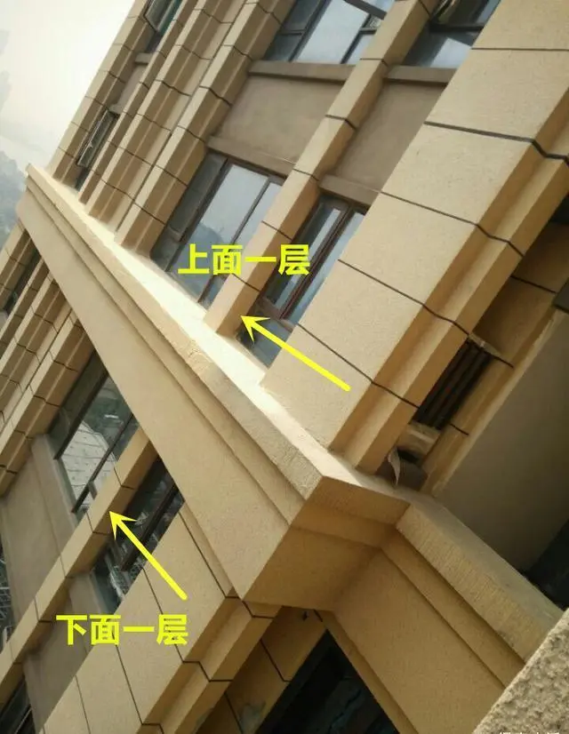

## 根据总楼层分类

## 一些需要注意的楼层

### 一 楼

  - 容易潮
  - 蚊虫多

### 顶层

  - 房屋质量不好容易渗水发霉
  - 夏热冬冷

### 设备层

  - 高层建筑的某一楼层，其有效面积全部或大部分用来作为空调、给水排水、电气、电梯机房等设备的布置
  - 存在一定的噪音
  - 小于30米的建筑，设备楼层通常在顶层或地下室
  - 30米以上的高层建筑，从10层到20层设置一个设备层

### 腰线层

  - 开发商为了楼的美观做的装饰
  - 可能影响采光, 尺寸比较大的话会影响下层采光
  - 可能积水积雪, 导致下层渗漏水
  - 杂物灰尘
  - 安全, 被盗风险
  - 会被计入公摊？？

|  |  |  |
| ------------------------------------------------------------ | ------------------------------------------------------------ | ------------------------------------------------------------ |
|  |  |                                                              |

### 槽钢层

  - 施工时固定槽钢的楼层
  - 槽钢用于固定塔吊/脚手架/防尘网/施工电梯
  - 槽钢洞是拆除设备后回填的
  - 如果处理的不好会导致时间长了后开裂渗水

### 避难层

  - 超过 100 m 的楼中设置避难层
  - 用于消防避难
  - 两个避难层之间 \<= 50m

### 高低楼层选择

| 高低楼层 / 因素 | 采光 | 空气质量 | 噪音 | 私密性 | 安全性 | 方便性 |
| --------- | -- | ---- | -- | --- | --- | --- |
| 高楼层       | 较好 | 较好   | 较好 | 较好  | 一般  | 一般  |
| 低楼层       | 一般 | 一般   | 一般 | 一般  | 较好  | 较好  |
