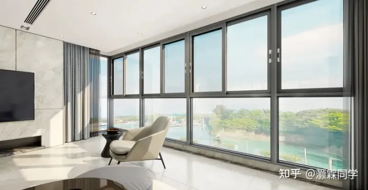
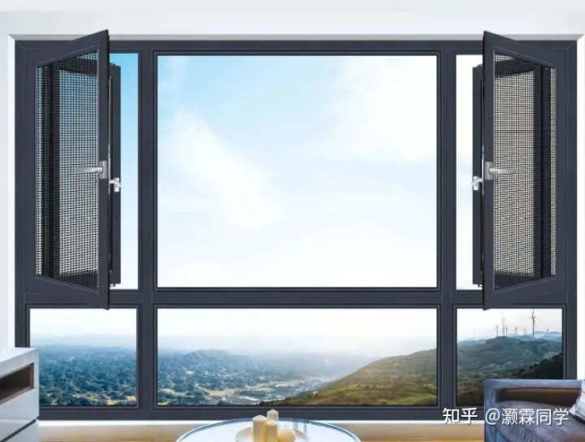
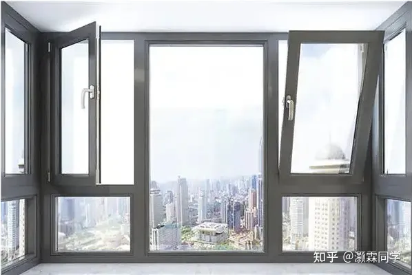
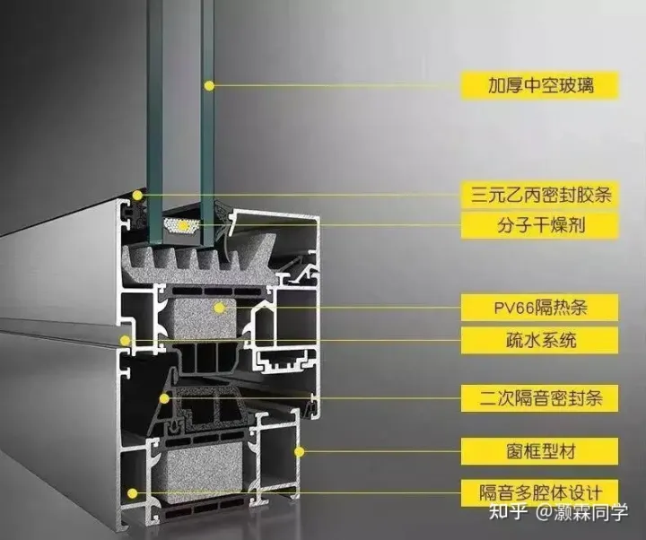
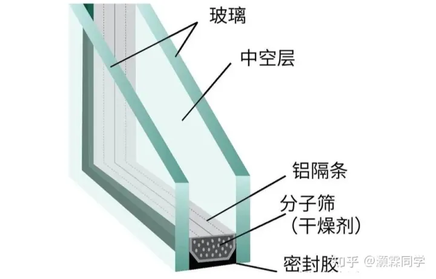

-----

| Title         | 概念 窗户                                           |
| ------------- | ----------------------------------------------- |
| Created @     | `2022-12-24T15:09:16Z`                          |
| Last Modify @ | `2022-12-24T15:09:16Z`                          |
| Labels        | \`\`                                            |
| Edit @        | [here](https://github.com/junxnone/F/issues/46) |

-----

## Reference

  - [常见的门窗窗型的种类有哪些？](https://www.zhihu.com/question/397787890?utm_id=0)

## 推拉窗

  - 采光通风性能好
  - 开启时不占室内空间
  - 框扇间存在缝隙
      - 密封性和隔音性一般
      - 抗风压性能不足

## 平开窗

  - 安全性高
  - 防盗性好
  - 密封性强
  - 隔音隔热
  - 内开窗开启时会占用一部分室内空间
  - 外开窗存在窗户坠落的风险

## 内开内倒窗

  - 安全性高
  - 开启方式多样
  - 通风功能更加优化
  - 防盗性好
  - 防雨水
  - 占用室内空间
  - 价格贵

## 门窗型材

  - 普通铝合金
  - 断桥铝合金

## 门窗玻璃

