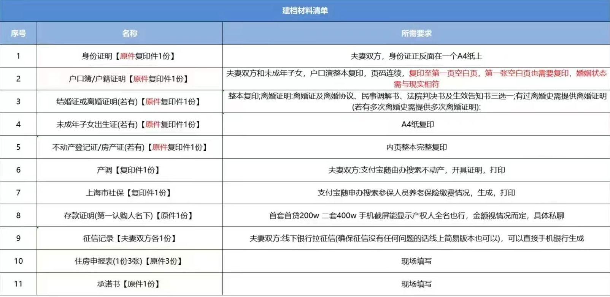

-----

| Title     | 概念 认筹                                           |
| --------- | ----------------------------------------------- |
| Created @ | `2023-03-06T03:06:28Z`                          |
| Updated @ | `2023-03-06T03:06:28Z`                          |
| Labels    | \`\`                                            |
| Edit @    | [here](https://github.com/junxnone/F/issues/60) |

-----

> 某些地区为了限制炒房出台的一手房购买政策

## 上海一手房认筹

  - 一手房开盘前开发商会进行认筹
  - 买家们需要提交资料认筹
  - 开发商和房产交易所为买家建档，并根据认筹人数和房源套数比例决定是否开启积分入围摇号选房模式
      - 当认筹超过一定比例 (1.3 倍的房源套数), 开启积分入围摇号选房模式
  - 积分在认筹的所有人当中排名靠前(取1.3, 有的 1.8)入围
  - 开发商公布入围名单
  - 开发商公开摇号决定选房顺序
  - 开盘，选房

### 认筹需要提交的证件材料

  - **基本项**
      - **身份证**
      - **户口本(所有页)**
      - **结婚证(认购对象为夫妻)**
      - **社保证明 (随申办可拉取)**
  - **现场填写**
      - 住房申报表
      - 承诺书
  - 其他
      - 未成年子女出生证
      - 房产证
      - 产调
      - 存款证明

#### 例

