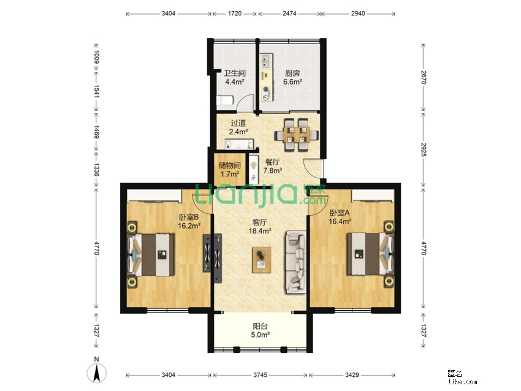

-----

| Title     | 概念 户型                                           |
| --------- | ----------------------------------------------- |
| Created @ | `2023-03-08T03:47:50Z`                          |
| Updated @ | `2023-03-08T03:47:50Z`                          |
| Labels    | \`\`                                            |
| Edit @    | [here](https://github.com/junxnone/F/issues/64) |

-----

## 飞机户型

  - 客厅在中间, 卧室在两边, 像飞机两个翅膀
      - 对称
      - 客厅南北通透, 空气流通
      - 卧室之间隔着客厅, 互相不影响, 比并排卧室好

## 动静分离

  - 卧室和客厅餐厅厨房分开,各占一边

