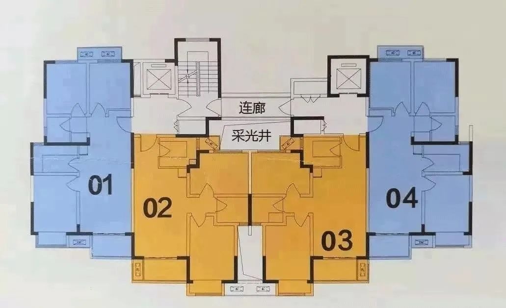
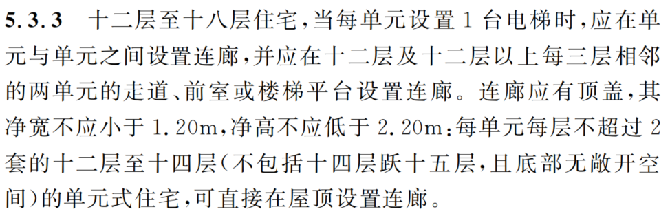

-----

| Title     | 概念 消防连廊                                         |
| --------- | ----------------------------------------------- |
| Created @ | `2023-03-09T14:15:12Z`                          |
| Updated @ | `2023-03-09T14:15:12Z`                          |
| Labels    | \`\`                                            |
| Edit @    | [here](https://github.com/junxnone/F/issues/70) |

-----

# 消防连廊

  - 连接同一幢楼的两个单元
  - 用于火宅时的安全疏散, 一个单元起火，可以通过连廊逃到另一单元逃生
  - **缺点**
      - 采光差
      - 隐私性不好
      - 安全性不好
  - 优点
      - 价格会低

## 设置消防连廊的条件

  - 14 层以上必须做连廊
  - 12\~18层 两梯四户 ？\[14/17\]
  - 16层以上必须层层做连廊??

> 参考 上海 \<住宅设计标准 - DG/J08-20-2019\> 5.3.3

## Reference

  - [建筑设计防火规范 2018](https://www.mohurd.gov.cn/gongkai/fdzdgknr/tzgg/201805/20180509_235971.html)
  - [住宅设计标准 -
    DG/J08-20-2019](https://github.com/junxnone/F/files/10932149/default.pdf)
