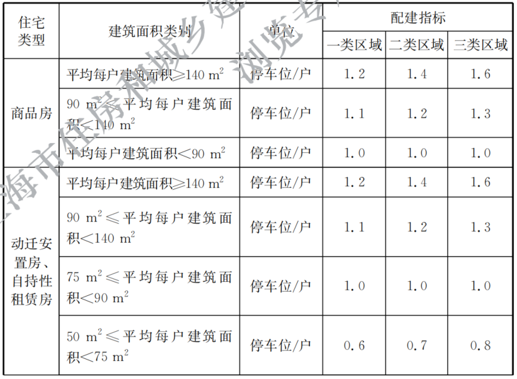
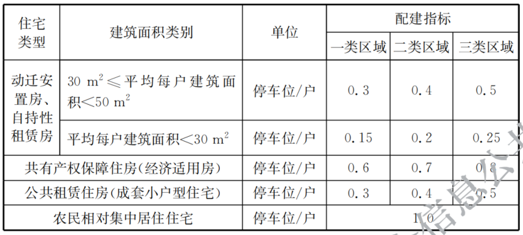

-----

| Title     | 概念 车位比                                          |
| --------- | ----------------------------------------------- |
| Created @ | `2023-03-09T15:14:26Z`                          |
| Updated @ | `2023-03-09T15:34:43Z`                          |
| Labels    | \`\`                                            |
| Edit @    | [here](https://github.com/junxnone/F/issues/71) |

-----

# 车位比

  - 建筑面积越大 车位比越大
  - 商品房一般大于 `1.0`
  - 动迁房 如果小户型多，则车位比会小于 `1.0`

## 住宅车位比要求

> 参照 \<建筑工程交通设计及停车库（场）设置标准 DG/TJ08-7-2021\> 5.2.10

## Reference

  - [建筑工程交通设计及停车库（场）设置标准.pdf](https://github.com/junxnone/F/files/10932959/default.pdf)
