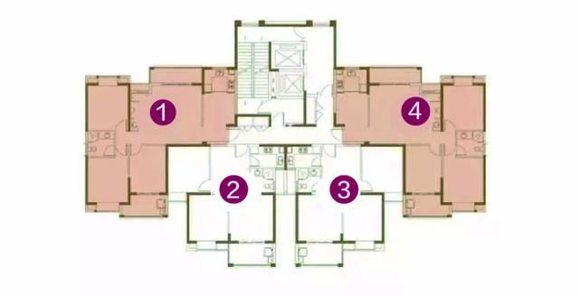

-----

| Title     | 概念 边套                                           |
| --------- | ----------------------------------------------- |
| Created @ | `2023-05-28T15:52:36Z`                          |
| Updated @ | `2023-05-28T15:52:36Z`                          |
| Labels    | \`\`                                            |
| Edit @    | [here](https://github.com/junxnone/F/issues/85) |

-----

# 边套

  - 楼栋中总有边套和中间套，可能会是不同的面积，户型，又有可能有不同的环境，窗景等等

## 东边套 vs 西边套 vs 中间套

  - **采光**
      - 边套边上有没有窗户, 有窗户采光更好，
      - 凹进去的东边套只有上午能晒到太阳，容易阴冷
  - **通透**
      - 一梯四户+, 边套一般南北通透，中间套有可能没有北侧窗户
      - 厨房卫生间有可能没窗户
  - **噪声**: 有的边套靠近马路, 容易吵
  - **视野**: 选择视野好的
  - **隐私**: 有的户型阳台窗户和邻居紧挨着
  - 多雨的话, 如果多东南风，东边套容易渗水, 房屋质量不好容易发霉

