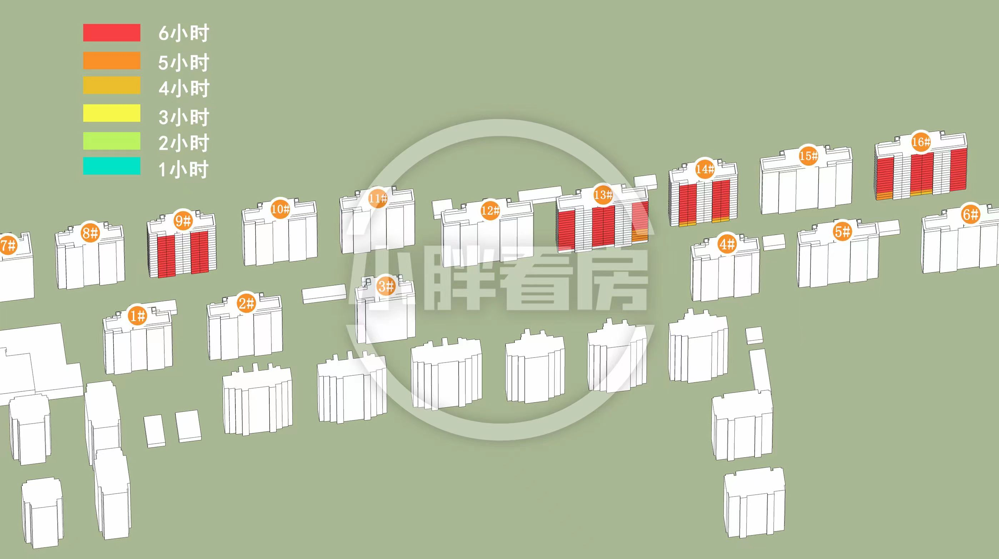

-----

| Title     | 一手房 闵行吴泾 象屿招商公园1872 北四批次选房                      |
| --------- | ----------------------------------------------- |
| Created @ | `2023-06-22T15:03:40Z`                          |
| Updated @ | `2023-07-22T16:11:20Z`                          |
| Labels    | \`\`                                            |
| Edit @    | [here](https://github.com/junxnone/F/issues/87) |

-----

# 北区四批次选房

## 房源分布及户型分布

## 楼层平面图

## 日照分析

### 冬至

### 春分秋分

### 夏至

## 户型分析

| 95/D                                                         | 106/B/3面宽                                                    | 106/C/3.5面宽                                                  | 135/A/4面宽                                                    |
| ------------------------------------------------------------ | ------------------------------------------------------------ | ------------------------------------------------------------ | ------------------------------------------------------------ |
|  |  |  |  |

## 一房一价表

[google
sheet](https://docs.google.com/spreadsheets/d/1hrWISU4hnQBTtGJgkzVooksbYsYpqrEZRxiTBqjB9d4/edit?usp=sharing ":include :type=iframe width=100% height=800px")
