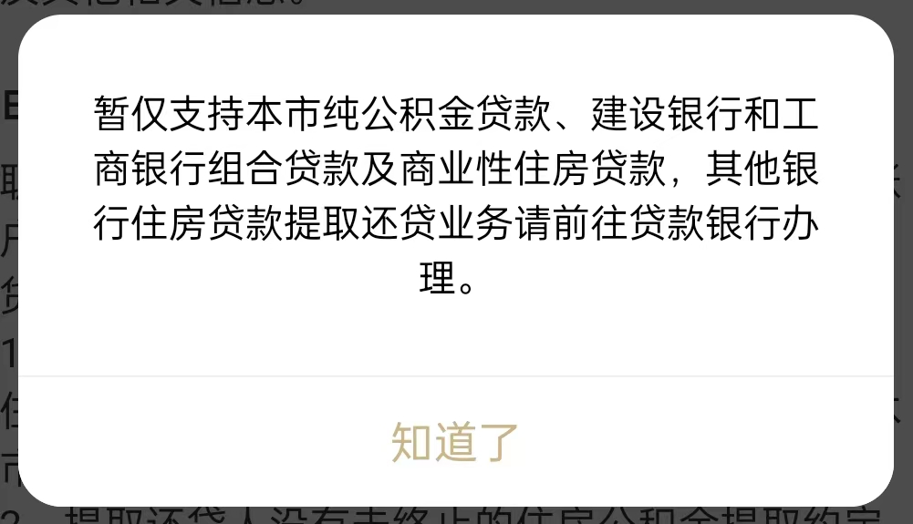
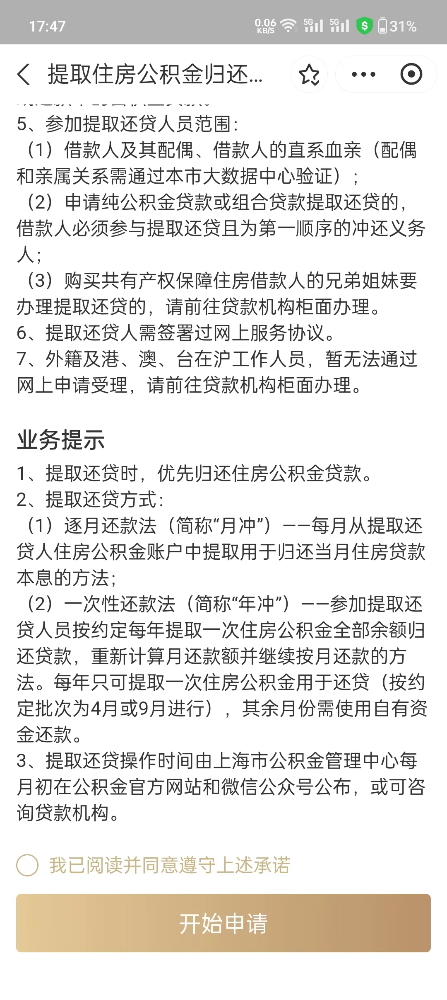

-----

| Title     | 概念 贷款 公积金贷款                                     |
| --------- | ----------------------------------------------- |
| Created @ | `2023-06-27T02:23:13Z`                          |
| Updated @ | `2023-08-30T14:05:31Z`                          |
| Labels    | \`\`                                            |
| Edit @    | [here](https://github.com/junxnone/F/issues/92) |

-----

# 公积金贷款

  - 工作有缴纳公积金

## 贷款年限

  - 最长期限不超过申请人法定退休年龄后5年(65 = 60+5)
      - 目前男 65/女 60 `@2023.6`
  - 购买一手房, 公积金贷款最长期限不超过 30年
  - 购买二手房
      - 房龄 \< 5 年, 公积金贷款最长期限不超过 30年
      - 5 \< 房龄 \< 20, 公积金贷款最长期限不超过 (35 - 房龄) 年
      - 房龄 \> 20, , 公积金贷款最长期限不超过 15 年

## 贷款额度

  - 首套住房 - 个人最高 50 W, 家庭最高 100 W
  - 二套改善 - 个人最高 40 W, 家庭最高 80 W
  - \+补充公积金 - 个人最高 +10 W, 家庭最高 +20 W
  - **要求首付比例**
  - 面积小于 90m2, 首套不得低于 20%, 二套不得低于 50%
  - 面积大于 90m2, 首套不得低于 30%, 二套不得低于 70%

## 贷款利率

  - 首套 (基准利率)
      - 贷款期限小于 5 年 2.75 %
      - 贷款期限大于 5 年 3.25 %
  - 二套基准利率上浮 10% (基准利率 \* 1.1)
      - 贷款期限小于 5 年 3.025 %
      - 贷款期限大于 5 年 3.575 %

## 其他

  - **审批时限**: ≤ 10 工作日
  - **放款时限**: 审核通过后 ≤ 5 工作日

> **纯公积金贷款服务网点**：上海市住房置业融资担保有限公司业务网点。 **公积金组合贷款服务网点**：住房公积金个人贷款受托银行业务网点。

## 还款

### 月冲

  - 逐月还款法: 每月从提取还贷人住房公积金账户中提取用于归还当月住房贷款本息的方法
  - 公积金账户有较多余额的，开始一段时间只需要还商贷，还款压力较小

### 年冲

  - 一次性还款法:
    参加提取还贷人员按约定每年提取一次住房公积金全部余额归还贷款，重新计算月还款额并继续按月还款的方法。每年只可提取一次(4/9
    月两个批次可申请)，其余月份需使用自有资金还款
  - **优点:** 相当于提前还款，可以减少总利息，减少每月还款额
  - **缺点:** 公积金月供需要每月支付，相对于 `月冲` 每月还款压力较大

> 目前上海线上办理只支持 `纯公积金贷款` & `建行组合贷/商贷` & `工行组合贷/商贷`, 其他银行需要到贷款银行办理。
> 
> 

## Reference

  - [个人住房公积金贷款申请](https://www.shgjj.com/html/newxxgk/ywzn/sydk/dksq/209130.html)
