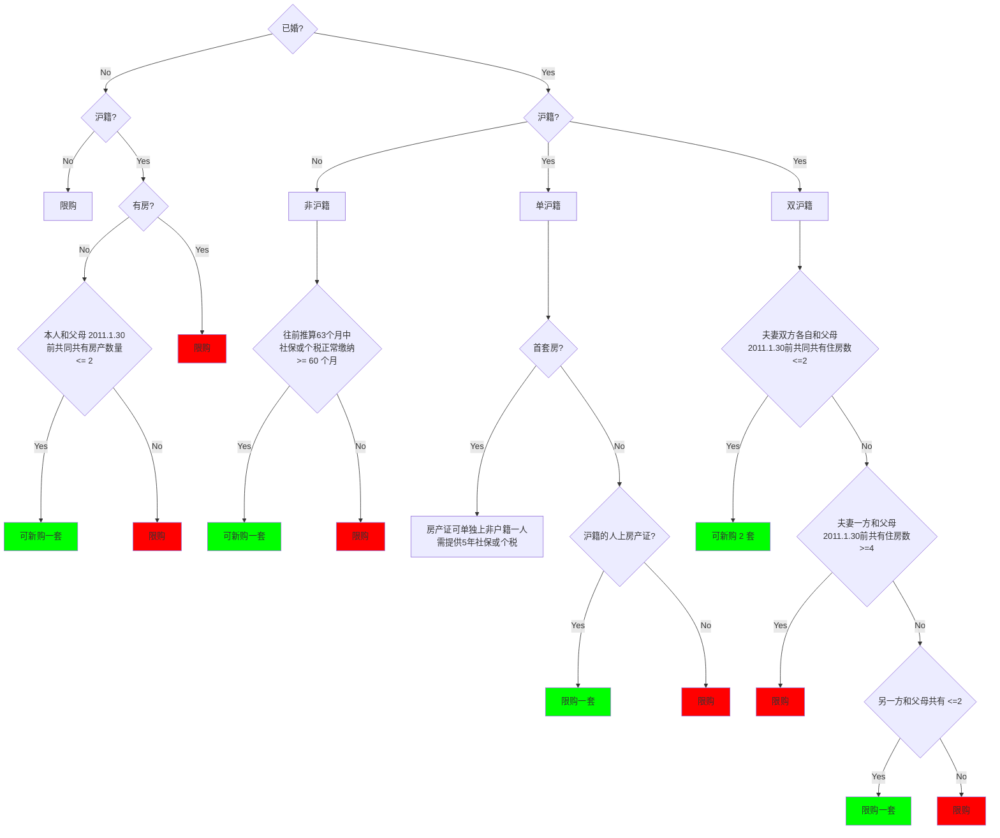

---
Title | 概念 购房资格
-- | --
Created @ | `2022-10-15T07:53:44Z`
Last Modify @| `2022-12-18T07:49:49Z`
Labels | ``
Edit @| [here](https://github.com/junxnone/F/issues/4)

---
## Reference
- [上海房产交易政策：新房认筹篇（积分＋流程）2022.1月更新](https://new.qq.com/omn/20220116/20220116A05Y9Z00.html)

## 购房资格

- 各地出台了相关限购政策用来限制炒房
- 购买二手房资格
- 购买新房资格

## 购房资格自查图

## 新房购买

- 认筹 - 提交资料证明
- 打分 - 审查
- 房源数量 N 的 1.3 倍作为界限, 筛选入围人数X (`N x 1.3`), 积分排名前 X 名可以参与摇号
- 摇号(积分高低决定是否入围, 不决定选房优先权)

### 新房购买积分

积分类型 | 积分项 | 积分要求 | 分值
-- | -- | -- | --
基础分 | 沪籍 | 是 | 10
基础分 | 已婚 | 是 | 20
基础分 | 名下上海无房 | 无 | 20
基础分 | 名下上海无房, 且5 年内无购房记录 | 无 | 20
年限分 | 社保 | 缴纳 | 之前20年内, 缴纳月数 * (0.1~0.24) 

> 年限分 系数各楼盘不同
