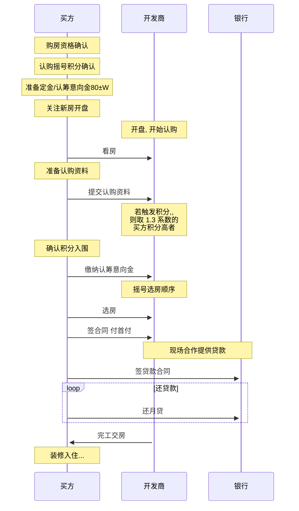
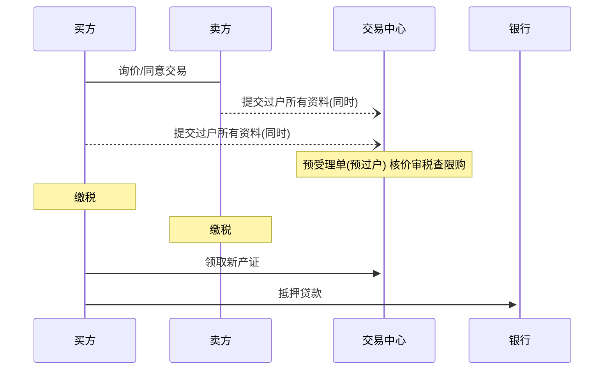

---
Title | 购房流程
-- | --
Created @ | `2022-10-15T12:02:12Z`
Last Modify @| `2022-11-05T07:54:52Z`
Edit @| [here](https://github.com/junxnone/F/issues/7)

---
## 新房购买流程

```mermaid
sequenceDiagram
    participant 买方 
    participant 开发商
    participant 银行
    Note over 买方: 购房资格确认
    Note over 买方: 认购摇号积分确认
    Note over 买方: 准备定金/认筹意向金80±W
    Note over 买方: 关注新房开盘
    Note over 开发商: 开盘, 开始认购
    买方->>+开发商: 看房
    Note over 买方: 准备认购资料
    买方->>+开发商: 提交认购资料
    Note over 开发商: 若触发积分,,<br>则取 1.3 系数的<br>买方积分高者
    Note over 买方: 确认积分入围
    买方->>+开发商: 缴纳认筹意向金
    Note over 开发商: 摇号选房顺序
    买方->>+开发商: 选房
    买方->>+开发商: 签合同 付首付
    Note over 银行,开发商: 现场合作提供贷款
    买方->>+银行: 签贷款合同
    loop 还贷款
    买方->>+银行: 还月贷
    end 
    开发商->>+买方: 完工交房
    Note over 买方: 装修入住...

```

## 二手房购买流程

```mermaid
sequenceDiagram
    买方->卖方: 询价/同意交易
    卖方--)+交易中心: 提交过户所有资料(同时)
    买方--)+交易中心: 提交过户所有资料(同时)
    Note over 交易中心: 预受理单(预过户) 核价审税查限购
    Note over 买方: 缴税
    Note over 卖方: 缴税
    买方->>+交易中心:  领取新产证
    买方->>+银行: 抵押贷款

```
